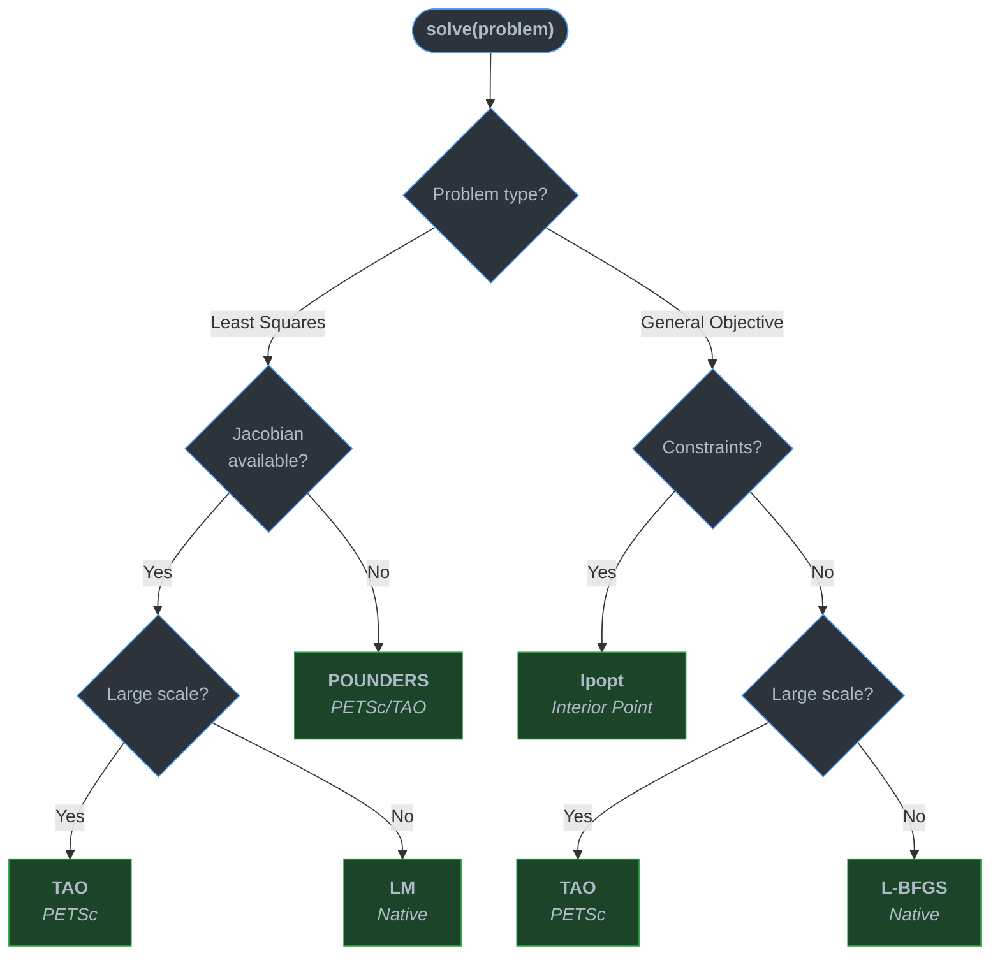

# Solvers

**High-performance numerical solving and optimization for modern C++.**

Solvers combines optimized native algorithms for the numerical problems
encountered most often in calibration and scientific computing with
specialized third-party engines for constrained and large-scale optimization.

**Native performance** &mdash;
Brent &middot; Newton &middot; Ridders &middot; Levenberg&ndash;Marquardt &middot; Gauss&ndash;Newton &middot;
BFGS &middot; L-BFGS &middot; Polynomial roots

**Advanced optimization** &mdash;
Ipopt &middot; PETSc/TAO &middot; POUNDERS

**One API** &mdash;
Describe the mathematical problem. Solvers selects the appropriate engine.

Built for model calibration and performance-sensitive scientific applications.

**Developed and maintained by [KhwarizmiAnalytix](https://github.com/KhwarizmiAnalytix)**


---

## Problem &rarr; Solver

Solvers chooses the numerical engine from the mathematical structure of
the problem, rather than exposing a collection of unrelated backend APIs.



---

## 30-Second Example

```cpp
#include "solvers/api/solve.h"
using namespace solverslib::api;

// Fit y = a * exp(b * t) to data
least_squares_problem problem;
problem.num_parameters = 2;
problem.num_residuals  = data.size();
problem.residuals = [&](const vector_type& x, vector_type& r) {
    for (size_t i = 0; i < data.size(); ++i)
        r[i] = x[0] * std::exp(x[1] * times[i]) - data[i];
};
problem.jacobian = [&](const vector_type& x, matrix_type& J) {
    for (size_t i = 0; i < data.size(); ++i) {
        double e = std::exp(x[1] * times[i]);
        J(i, 0) = e;
        J(i, 1) = x[0] * times[i] * e;
    }
};

vector_type x0(2);
x0 << 1.0, 0.0;

auto result = solve(problem, x0);
// Backend::Auto -> Native LM for this problem

if (result.converged()) {
    // result.parameters, result.objective, result.residual_norm
}
```

Every call returns a `solver_result` with uniform status, final iterate,
objective value, iteration count, and which backend/algorithm actually ran.

---

## Why Solvers?

### Native where performance matters

Common hot-path algorithms are implemented natively with no external
runtime dependency:

```
Brent / Newton / Ridders          scalar root finding
Levenberg-Marquardt / Gauss-Newton   nonlinear least squares
BFGS / L-BFGS                    smooth unconstrained optimization
Polynomial roots (degree 2-4)    closed-form with stability safeguards
```

If you only need these, you do not need PETSc or Ipopt.

### Specialized engines where they add value

```
Ipopt       constrained nonlinear programming (interior point)
PETSc/TAO   large-scale / Newton-Krylov / matrix-free optimization
POUNDERS    derivative-free nonlinear least squares
```

No duplicate third-party backends solving the same problem.

### One problem-oriented API

Application code depends on:

```cpp
least_squares_problem   // residuals + optional Jacobian
optimization_problem    // objective + gradient + optional constraints
solve_options           // tolerances, backend pin, algorithm pin
solver_result           // status, parameters, objective, diagnostics
```

Not on `Ipopt::TNLP`, `Tao`, or `ceres::Problem`.

### Built for calibration

Analytical Jacobians, finite-difference fallback, parameter bounds,
convergence diagnostics, deterministic execution, configurable
tolerances, explicit termination status.

---

## Capabilities

| Problem | Solver | Implementation |
|---------|--------|----------------|
| *f*(*x*) = 0 | Brent, Newton, Ridders, Bisection, Secant | Native |
| min &half;&Vert;*r*(*x*)&Vert;&sup2; with Jacobian | Levenberg&ndash;Marquardt, Gauss&ndash;Newton | Native |
| min &half;&Vert;*r*(*x*)&Vert;&sup2; without Jacobian | POUNDERS | PETSc/TAO |
| Smooth unconstrained min *f*(*x*) | BFGS, L-BFGS | Native |
| Bound/equality/inequality constrained min *f*(*x*) | Interior Point | Ipopt |
| Large-scale / matrix-free | Newton-Krylov, trust region | PETSc/TAO |
| Polynomial roots (degree 2&ndash;4) | Closed-form solver | Native |

---

## Native-First, Specialized When Necessary

Solvers does not wrap multiple libraries that solve the same problem.

Common performance-critical algorithms are implemented natively.
External libraries are used only when they add a distinct numerical
capability:

| Backend | Library | Compile Flag | Discovery | Capability |
|---------|---------|--------------|-----------|------------|
| **Native** | Built-in | Always on | N/A | LM, GN, L-BFGS, root finding, polynomials |
| **Ceres** | [Ceres Solver](http://ceres-solver.org/) | `SOLVERS_ENABLE_CERES` | Bundled submodule | LS with bounds, sparse solvers |
| **Ipopt** | [Ipopt](https://github.com/coin-or/Ipopt) | `SOLVERS_ENABLE_IPOPT` | `pkg-config` | Interior-point NLP, general constraints |
| **PETSc/TAO** | [PETSc](https://petsc.org/) | `SOLVERS_ENABLE_PETSC` | `pkg-config` + MPI | POUNDERS, Newton-Krylov, large-scale |

When a backend is not compiled in, the dispatcher returns
`solver_status::backend_unavailable` instead of silently falling back.

---

## Pinning a Backend or Algorithm

The dispatcher selects automatically, but you can override:

```cpp
solve_options options;

// Force Ceres for a least-squares problem
options.backend = backend::ceres;
options.ceres   = ceres_options{.linear_solver = ceres_linear_solver::dense_qr};

// Force Ipopt for a bounded objective
options.backend = backend::ipopt;
options.ipopt   = ipopt_options{.tol = 1e-10};

// Force POUNDERS for derivative-free least squares
options.algorithm = algorithm::pounders;
options.petsc_tao = petsc_tao_options{.gatol = 1e-6};

auto result = solve(problem, x0, options);
```

**Dispatch rules:**
- **Bounds** require Ceres (least squares) or Ipopt (objective).
- **Gradient required** on all objective paths.
- **Gauss-Newton** is never auto-selected; pin it explicitly.
- **Ceres** is reached only by explicit backend pin.
- **Large scale** triggers above a threshold (default 1000 parameters / 10000 residuals) or with `prefer_matrix_free = true`.

---

## Building

### Requirements

- C++17 compiler (Clang, GCC, MSVC)
- CMake 3.20+
- Ninja (recommended) or Make

### Optional Dependencies

| Dependency | Install | Purpose |
|------------|---------|---------|
| Ceres Solver | Bundled as submodule | Sparse least-squares backend |
| Ipopt | `brew install ipopt` / system pkg-config | Interior-point NLP backend |
| PETSc + MPI | `brew install petsc open-mpi` / system pkg-config | Large-scale / derivative-free backend |
| Google Test | Bundled as submodule | Test suite |

### CMake

```bash
git clone --recurse-submodules https://github.com/KhwarizmiAnalytix/Solvers.git
cd Solvers

# Minimal (native backends only)
cmake -B build -G Ninja -DCMAKE_BUILD_TYPE=Release
cmake --build build

# All backends
cmake -B build -G Ninja -DCMAKE_BUILD_TYPE=Release \
  -DSOLVERS_ENABLE_CERES=ON \
  -DSOLVERS_ENABLE_IPOPT=ON \
  -DSOLVERS_ENABLE_PETSC=ON
cmake --build build

# Run tests
ctest --test-dir build
```

### CMake Options

| Option | Default | Description |
|--------|---------|-------------|
| `SOLVERS_ENABLE_TESTING` | `ON` (top-level) | Build the GoogleTest suite |
| `SOLVERS_ENABLE_CERES` | `OFF` | Build the Ceres backend |
| `SOLVERS_ENABLE_IPOPT` | `OFF` | Build the Ipopt backend |
| `SOLVERS_ENABLE_PETSC` | `OFF` | Build the PETSc/TAO backend |
| `SOLVERS_ENABLE_SANITIZER` | `OFF` | Address + UB sanitizers |
| `SOLVERS_ENABLE_COVERAGE` | `OFF` | Coverage instrumentation |
| `SOLVERS_ENABLE_CLANGTIDY` | `OFF` | clang-tidy static analysis |
| `BUILD_SHARED_LIBS` | `OFF` | Build as shared library |

### setup.py (Build Script)

```bash
# Configure, build, and test (native only)
python Scripts/setup.py config.build.test

# All backends
python Scripts/setup.py config.build.test.ceres.ipopt.petsc

# GCC, debug, with coverage
python Scripts/setup.py config.build.test.gcc.debug.coverage
```

---

## Testing

```bash
ctest --test-dir build

# Specific test
./build/Testing/Cxx/SolversTests --gtest_filter="SolverApiDispatch.*"

# Benchmarks
./build/Testing/Cxx/SolversBenchmark
```

---

## License

BSD-3-Clause. See [LICENSE](./LICENSE) for the full text.

Copyright (c) 2024 KhwarizmiAnalytix
