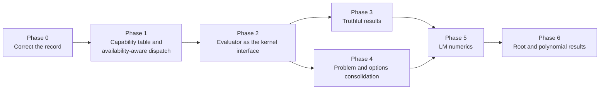

# Design review and phased plan — 2026-10-04

Status: review completed; all phases (0–6) implemented. See [Implementation status](#implementation-status) at the end for results and deviations from the plan as written.

Baseline: commit `588c14c` (plus a formatting-only local edit to `src/solvers/rnc_lm_solver.cpp`).

Related documents:

- [solver-redesign-2026-09-26.md](solver-redesign-2026-09-26.md) — the original redesign review (findings F01–F08 and later). This plan does not repeat those findings; it covers the state of the problem-structure API (`solverslib::api`) that came out of that redesign.
- [IMPLEMENTATION_COMPLETION_REPORT_2026-09-27.md](IMPLEMENTATION_COMPLETION_REPORT_2026-09-27.md) — reports Milestone 1 (single derivative resolver) as complete. Findings D3 and D4 below show it is only partly complete; Phase 0 corrects the record.

## Assessment

The `api::solve` layer has the right shape:

- it inspects the problem's traits, then selects an algorithm and a backend, then returns one structured result;
- it names the algorithm separately from the backend that runs it;
- it uses one closed `solver_status` vocabulary;
- it rejects capabilities a backend cannot enforce instead of silently dropping them.

Keep these boundaries. The remaining problems are that dispatch decisions don't match what was actually built, derivative handling is spread over several code paths, and results report zeros where the true answer is "unknown". The plan fixes behavioral defects first, then the evaluation layer underneath them, then API consolidation and numerics.

## Findings

P1 means a contract or correctness defect. P2 means an architectural, performance, or numerical weakness. "Source-confirmed" means the behavior follows directly from the control flow cited. None of these were reproduced at runtime in this session.

| ID | Pri | Finding | Evidence |
|---|---|---|---|
| D1 | P1 | Automatic dispatch selects backends that are not compiled in. A residual-only least-squares problem resolves to POUNDERS, so a default build (PETSc `OFF`) returns `backend_unavailable`, even though native LM can solve it with finite differences. Tests lock this in. | [dispatch.cpp `select_algorithm`](../../src/api/dispatch.cpp#L323-L334), [TestSolverApiDispatch.cpp](../../Testing/Cxx/TestSolverApiDispatch.cpp#L265-L278) |
| D2 | P1 | The automatic Ceres AD route is unreachable. `backend_for` requires `has_autodiff_provider && !has_jacobian_provider`, but `set_jacobian_provider` is the only writer of `provider_factory` and always sets `jacobian_provider` too. | [dispatch.cpp `backend_for`](../../src/api/dispatch.cpp#L47-L54), [problem.h setter](../../include/api/problem.h#L98-L109) |
| D3 | P1 | Derivative resolution is still split. TAO least squares calls `resolve_derivatives` and then ignores the result. Native L-BFGS, Ipopt, and TAO-objective each have their own order of preference; Ipopt and TAO-objective ignore `options.derivatives` and never set `effective_derivative_source`. The resolver returns errors as a raw `new solver_result*`. | [dispatch.cpp](../../src/api/dispatch.cpp#L369-L438), [TAO LS](../../src/api/dispatch.cpp#L827-L841), [native opt](../../src/api/dispatch.cpp#L879-L908), [Ipopt](../../src/api/dispatch.cpp#L978-L994) |
| D4 | P1 | Results don't report honestly. The evaluation counters are plain `size_t` and stay 0 on every path except RNC-LM. `from_native` never sets `gradient_norm` or `step_norm`. A native LM stall at the damping ceiling is reported as `max_iterations`, which signals a usable iterate. Every Ipopt non-success, including hitting the budget, is reported as `numerical_failure`, because the adapters return `bool`. | [result.h](../../include/api/result.h#L29-L40), [from_native](../../src/api/dispatch.cpp#L92-L110), [LM ceiling](../../src/solvers/levenberg_marquardt_solver.cpp#L402-L406), [Ipopt status](../../src/api/dispatch.cpp#L1024) |
| D5 | P2 | Native kernels can't use a provider efficiently. The dispatcher wraps `compute()` and throws the residuals away, so residuals are computed twice. `AutoDiffJacobianProvider::compute` builds a new `DynamicAutoDiffCostFunction` on every call. Each AD evaluation makes three buffer copies plus a layout conversion. | [dispatch.cpp](../../src/api/dispatch.cpp#L467-L477), [autodiff_provider.h](../../include/solvers/integrations/autodiff_provider.h#L49-L64), [ceres_autodiff.h](../../include/solvers/integrations/ceres_autodiff.h#L56-L116) |
| D6 | P2 | `least_squares_problem` has five overlapping derivative fields, all public: `jacobian`, `jacobian_provider`, `provider_factory`, `model_provider_factory`, and `rnc_derivatives` with `rnc_derivative_source`. The rule tying `provider_factory` to `jacobian_provider` is enforced only by a setter. | [problem.h](../../include/api/problem.h#L65-L139) |
| D7 | P2 | Request validation is a 140-line chain of if-statements over backend × algorithm × capability. Bounds validation is duplicated between the two `solve` overloads, and native bounds rejection is duplicated inside each overload. | [validate_request](../../src/api/dispatch.cpp#L145-L282), [LS bounds](../../src/api/dispatch.cpp#L1134-L1158), [opt bounds](../../src/api/dispatch.cpp#L1225-L1246) |
| D8 | P2 | There are two option systems. `solver_options` has no `lm` field, so the LM damping, geodesic, and variant controls added in `34aaf5a` can't be reached from `api::solve`. `algorithm::bfgs` silently runs L-BFGS. | [options.h](../../include/api/options.h#L42-L47), [dispatch.cpp](../../src/api/dispatch.cpp#L506-L518) |
| D9 | P2 | LM solves the normal equations `JᵀJ + λD` with `PartialPivLU`. That squares the condition number and ignores that the matrix is symmetric positive definite. Each iteration builds an explicit `Jt` copy and allocates temporaries. The function tolerance is compared with ‖r‖, while the API defines the objective as ½‖r‖². | [LM](../../src/solvers/levenberg_marquardt_solver.cpp#L118), [L171](../../src/solvers/levenberg_marquardt_solver.cpp#L171), [L186-L187](../../src/solvers/levenberg_marquardt_solver.cpp#L186-L187) |
| D10 | P2 | Smaller issues. `auto_diff()` is defined in both `solverslib` and `solverslib::api`. `run_ceres` builds a `ceres_solver` and then rebuilds it. Root finders return `bool` and polynomial solvers return a single `double`. `default.profraw` and two PNGs are tracked in the repository root. | [autodiff_provider.h](../../include/solvers/integrations/autodiff_provider.h#L119), [derivative_provider.h](../../include/api/derivative_provider.h#L195), [run_ceres](../../src/api/dispatch.cpp#L676-L691) |

## Plan overview



| Phase | Findings | Public API change | Size |
|---|---|---|---|
| 0 | records, D10 (artifacts) | none | S |
| 1 | D1, D2, D7 | dispatch outcomes change; no signature change | M |
| 2 | D3, D5 | internal kernel signatures; provider internals | L |
| 3 | D4 | `solver_result` fields become `optional`; new status | M |
| 4 | D6, D8, D10 (`auto_diff`, Ceres rebuild) | problem derivative slot; `solver_options::lm` | M |
| 5 | D9 | none (numerical behavior only) | M |
| 6 | D10 (roots) | new structured root results; old functions kept | M |

Each phase ends with the full CMake and Bazel test suites green under the default build and under the `SOLVERS_ENABLE_CERES=ON` build. The `IPOPT` and `PETSC` builds run where those dependencies are available.

---

## Phase 0 — Correct the record

**Goal:** bring the documentation and repository state in line with the code before changing behavior.

Tasks:

1. In `IMPLEMENTATION_COMPLETION_REPORT_2026-09-27.md`, mark Milestone 1 as **partial** and link D3 here.
2. Untrack `default.profraw`, `convergence_svi.png`, and `svi_model_vs_targets.png`; add `*.profraw` to `.gitignore`. If the plots are documentation, move them under `docs/` and reference them from `svi_calib.md`.
3. Add failing or `DISABLED_` tests for D1 and D2 that state the intended behavior. These become the acceptance tests for Phase 1.

**Exit criteria:** the report matches the code; no build outputs are tracked; the D1 and D2 expectations are written down as tests.

---

## Phase 1 — Capability table and availability-aware dispatch

**Goal:** have one data table drive selection, validation, and error messages, and have automatic mode never choose a backend that isn't built.

**Design reference.** PyTorch's dispatcher registers kernels against a dispatch-key set and resolves a call by looking up the table, not by branching through code. Ceres validates `Solver::Options` against a fixed compatibility matrix in one function. We follow the PyTorch shape at a much smaller scale: a `constexpr` array, not a runtime registry. The earlier review explicitly deferred a general plugin registry, and this keeps it deferred.

Sketch (in `src/api/`, not public):

```cpp
enum class capability : std::uint16_t
{
    bounds              = 1u << 0,
    nonlinear_constraints = 1u << 1,
    hessian_vector      = 1u << 2,
    derivative_free     = 1u << 3,  // runs with no Jacobian/gradient source
    native_ad           = 1u << 4,  // consumes provider_factory directly
};

struct route
{
    api::backend   backend;
    api::algorithm algorithm;
    problem_kind   kind;          // least_squares | objective
    capability_set supports;
    bool         (*available)();  // e.g. &ceres_solver::is_supported
    int            priority;      // higher wins among eligible routes
    bool           large_scale;   // preferred when is_large_scale()
};

constexpr route routes[] = { /* one row per realizable pair */ };
```

Tasks:

1. Derive a `required` capability set from `problem_traits` (bounds, constraints, Hessian-vector product, whether any derivative source exists).
2. `select_route(traits, options)`:
   - keep rows that match `kind`, satisfy `required ⊆ supports`, and honor any pinned backend or algorithm;
   - in automatic mode, also require `available()`;
   - pick by `large_scale` preference, then `priority`.

   Example: residual-only least squares picks native LM with finite differences when PETSc is absent, and POUNDERS when it is present.
3. Make `select_backend` and `select_algorithm` thin wrappers over `select_route`, so the public test hooks in [dispatch.h](../../include/api/dispatch.h) keep their signatures.
4. Replace `validate_request` with:
   - (a) option sanity checks (budgets, tolerances, finite initial guess);
   - (b) a route lookup that, when no row matches, reports the first unmet capability by name. A pin to an unavailable backend still returns `backend_unavailable`.
5. Fix D2 by keying Ceres-native AD on `capability::native_ad` (present whenever `provider_factory` is set), not on the absence of `jacobian_provider`. Decide the priority explicitly. Recommendation: prefer Ceres when built and the provider exposes a factory, because that avoids the D5 wrapper cost.
6. Factor bounds validation into one `validate_bounds(const bounds&, std::size_t n)` used by both `solve` overloads, and delete the duplicate native-bounds rejections.

Tests:

- Table-driven test over the cross product {least squares, objective} × {has derivatives / none} × {bounds / none} × {each backend built / not built}. It asserts the selected route or the expected status. Use a test seam (an injectable availability function) so the "not built" cases run in every configuration.
- Update [TestLeastSquaresModels.cpp](../../Testing/Cxx/TestLeastSquaresModels.cpp) so the residual-only case expects native LM in the default build.

**Exit criteria:** D1, D2, and D7 are closed; `validate_request` is gone; adding a backend or algorithm pair means adding one table row.

---

## Phase 2 — Evaluator as the kernel interface

**Goal:** give every backend one derivative resolver, and have native kernels consume a single stateful evaluator instead of `std::function` pairs.

**Design reference.** Ceres separates `Problem` (what the user declared) from `Evaluator` (a per-solve object that evaluates residuals and an optional Jacobian into buffers it owns). PyTorch's `autograd.Function` similarly keeps per-call state in a context object rather than recomputing. The existing [`residual_evaluator` / `provider_factory`](../../include/api/detail/evaluator.h) pair already has this shape; this phase makes it the only path. One deviation from Ceres: we keep dense Eigen storage and a single parameter block. Residual-block graphs stay out of scope until sparse problems are a stated requirement.

Tasks:

1. Extend `residual_evaluator` with counters owned by the evaluator:

   ```cpp
   struct evaluation_counters
   {
       std::size_t residual_evaluations = 0;
       std::size_t jacobian_evaluations = 0;
   };
   virtual const evaluation_counters& counters() const = 0;
   ```

   Do the same for a new `gradient_evaluator` (objective, optional gradient), which serves the scalar-objective path.
2. Concrete evaluators (internal), each created once per solve:
   - `callback_residual_evaluator` — residual and Jacobian `std::function`s;
   - `provider_residual_evaluator` — wraps a `JacobianProvider` and reuses the residuals it computes;
   - `finite_difference_residual_evaluator` — the **single** finite-difference implementation, with a relative step `h_j = sqrt(eps) * max(1, |x_j|)` and bounds-aware stencils. It replaces the copies in the native kernels, such as [LM](../../src/solvers/levenberg_marquardt_solver.cpp#L50-L85) and its siblings;
   - `ceres_ad_residual_evaluator` — reuses the existing `CeresAutoDiffEvaluator`, but builds the cost function once and keeps row-major scratch buffers as members. Replace the element-wise finiteness loop with `allFinite()`.
3. Replace `resolve_derivatives` with:

   ```cpp
   struct resolved_derivatives
   {
       std::unique_ptr<detail::residual_evaluator> evaluator;
       api::derivative_mode                        source;
   };
   // C++17: the error alternative carries the solver_result to return.
   std::variant<resolved_derivatives, solver_result>
   resolve(const least_squares_problem&, const solver_options&, const route&, const vector_type&);
   ```

   Add an `optimization_problem` overload. Every `run_*` function calls `resolve` exactly once and uses its evaluator. TAO least squares, native L-BFGS, Ipopt, and TAO-objective all stop doing their own derivative selection.
4. Change the native kernels to take `detail::residual_evaluator&` (LM, GN, L-BFGS in least-squares mode) or `detail::gradient_evaluator&` (L-BFGS in objective mode). Keep the legacy `std::function` constructors by adapting them into `callback_residual_evaluator`, so existing callers and tests compile unchanged.
5. `AutoDiffJacobianProvider::compute` should hold one evaluator, created lazily and guarded per thread or by a mutex. Document that a provider used concurrently by several solves should go through `ceres_factory()->create_evaluator()`.
6. Handle evaluation failures in one place. An `invalid_trial` result rejects the step and increases damping; a `fatal_error` ends the solve with `numerical_failure` and the evaluator's `last_error()` as the message. No exceptions propagate out of `api::solve`.

Tests:

- Counting-evaluator tests that assert exact residual and Jacobian call counts for LM on a fixed problem. They detect any reintroduced double evaluation.
- A derivative-policy matrix, {automatic, supplied, AD, FD} × {callback, analytic provider, FD provider, AD provider} × {each backend}, that asserts `effective_derivative_source` and which evaluator ran.
- [BenchmarkSolvers.cpp](../../Testing/Cxx/BenchmarkSolvers.cpp) (`ceres-autodiff` section): record before and after timings for native LM with an AD provider.

**Exit criteria:** D3 and D5 closed; `grep -n "new solver_result" src/` is empty; every `run_*` path reports `effective_derivative_source`; the AD benchmark shows the per-call construction cost is gone.

---

## Phase 3 — Truthful results

**Goal:** make `solver_result` keep its own promise that zero never means "unknown".

**Design reference.** Ceres `Solver::Summary` separates termination type (`CONVERGENCE`, `NO_CONVERGENCE`, `FAILURE`, `USER_SUCCESS`) from the reason message, and reports each counter it tracks. We already have the status split; this phase supplies the data.

Tasks:

1. Change `residual_evaluations`, `jacobian_evaluations`, `gradient_evaluations`, `accepted_steps`, and `rejected_steps` to `std::optional<std::size_t>`. Fill them from evaluator counters (Phase 2) and from kernel step counters. Adapters that can't supply a value leave it `nullopt`.
2. Extend `native_result` with `gradient_norm`, `step_norm`, and accepted/rejected step counts, and copy them in `from_native`.
3. Add `native_convergence::stalled` for the LM damping-ceiling exit and any line-search exhaustion. Map it to a new `solver_status::stalled`. `stalled` keeps `has_usable_iterate() == true`, because the last accepted point is still valid, but `converged()` is false and the status is distinct from budget exhaustion.
4. Have the Ipopt and TAO adapters return a status struct instead of `bool`, carrying the native code (`ApplicationReturnStatus`, `TaoConvergedReason`). Map it in the dispatcher, keep the raw code in `backend_status`, and distinguish budget, convergence, and failure.
5. Fix the Ceres mapping to treat `USER_SUCCESS` and `USER_FAILURE` explicitly, and to set `backend_status`.

Tests:

- One test per status per backend that the build includes: converged, budget, stalled, failure.
- A test that every result field is either engaged or deliberately `nullopt`, checked against a per-route table.

**Exit criteria:** D4 closed; the `result.h` header comment is accurate.

---

## Phase 4 — Problem and options consolidation

**Goal:** give each problem one derivative slot, and give `api::solve` a single source of configuration.

**Design reference.** In PyTorch a tensor carries one `grad_fn`, and capabilities are discovered from it, not from parallel fields on the tensor. In Eigen, solver tuning lives on the solver object (`setTolerance`, `setMaxIterations`), with algorithm-specific knobs on the algorithm-specific type. We follow both: one provider slot that advertises capabilities, and algorithm-specific option structs next to the common ones (which already exist for RNC-LM, Ceres, Ipopt, and TAO).

Tasks:

1. Replace the five derivative fields on `least_squares_problem` with a single private `std::shared_ptr<JacobianProvider>` and accessors. Extend `JacobianProvider` with optional capability queries:
   - `ceres_factory()` (already present);
   - `curve_derivatives()`, which returns an `rnc_derivative_function` or empty and is used by RNC-LM.

   The `jacobian` callback becomes sugar for `analytic_jacobian(...)`. `model_provider_factory` becomes an internal detail of `least_squares(model, n, m)`.
2. Migration: keep the old public fields for one release as `[[deprecated]]`, with an internal normalization step at the top of `solve` that builds the provider from them. Add a test that old-style and new-style problems dispatch the same way.
3. Make the same change on `optimization_problem` for `gradient` / `gradient_provider`.
4. Add `std::optional<api::lm_options> lm` to `solver_options`, mirroring `solver_options_lm`: variant, bold acceptance, geodesic acceleration and threshold, damping factors, floors and ceilings. Map it in the native LM route. Validate it at the solve boundary, the way `rnc_lm_options` already is.
5. Either implement full-memory BFGS or remove `algorithm::bfgs` from the enum. Recommendation: remove it until it has a separate implementation, so the reported algorithm is always what ran.
6. Keep `auto_diff()` only in `solverslib::api`, and remove the duplicate from [autodiff_provider.h](../../include/solvers/integrations/autodiff_provider.h#L119).
7. Construct `ceres_solver` once in `run_ceres`, choosing the constructor before building it.
8. Write down the long-term status of the legacy `solver_options_*` builders. Recommendation: internal only, reached through `api::solve`; public use deprecated once item 4 lands.

**Exit criteria:** D6, D8, and the API parts of D10 closed; the README quick start uses only `api::` types.

---

## Phase 5 — LM numerics

**Goal:** a better-conditioned, allocation-free LM step with the objective defined consistently.

**Design reference.** Eigen's unsupported `LevenbergMarquardt` module and MINPACK `lmder` solve the augmented least-squares system `[J; √λ·D] δ = [r; 0]` with a QR factorization. That avoids forming `JᵀJ`, so the condition number is not squared. Ceres offers both `DENSE_QR` and `DENSE_NORMAL_CHOLESKY` for the same reason. We follow the same two-option approach.

Tasks:

1. Add `linear_solver` to `lm_options` with two values:
   - `normal_ldlt` (default): `Eigen::LDLT` on `JᵀJ + λD`, replacing `PartialPivLU`; fast for m ≫ n;
   - `augmented_qr`: `Eigen::ColPivHouseholderQR` (or `HouseholderQR`) on the stacked system; robust for ill-conditioned J.

   Both stay behind [`linear_system_solver`](../../include/detail/eigen_support.h#L80-L89), so solver code keeps its single dense-algebra boundary. A factorization failure reports `numerical_failure`.
2. Move every temporary into a workspace struct allocated once per solve (`remainder`, `coordinate_scale`, `Jt`); use `J.transpose()` expressions instead of materializing `Jt`.
3. Make the function tolerance compare `F = ½‖r‖²` and document it in [levenberg-marquardt.md](../levenberg-marquardt.md). This is a behavior change for callers who rely on the current ‖r‖ semantics; note it in the changelog and adjust test tolerances deliberately.
4. Re-run [TestLeastSquaresModels.cpp](../../Testing/Cxx/TestLeastSquaresModels.cpp) and the SVI calibration benchmark under both linear solvers, and record iteration counts and final costs in `docs/levenberg-marquardt.md`.

**Exit criteria:** D9 closed; literature problems pass under both linear solvers; no heap allocation inside the iteration loop (checked with a counting allocator in a test, or by inspection under ASan).

---

## Phase 6 — Root and polynomial results

**Goal:** bring scalar root finding and polynomial roots into the structured-result model. This continues F06 and F07 from the 2026-09-26 review.

Tasks:

1. Add `root_result { solver_status status; double root; double residual; std::size_t iterations; std::size_t evaluations; std::string message; }` and an `api::find_root(...)` entry point that takes a method enum and a bracket or initial point. Keep the current `bool` functions as thin wrappers.
2. Add a polynomial entry point that returns every real root, `std::vector<double>` sorted, with selection policies (minimum positive, within interval) as separate named functions. This makes the old "clamp to threshold" behavior an explicit, opt-in operation.
3. Run every root method through a shared contract test: target offset, endpoint zeros, invalid bracket, iteration limit, non-finite evaluation.

**Exit criteria:** every public solver entry point has a structured-result form; the `bool` and `double` forms are documented as convenience wrappers.

---

## Out of scope

These follow the 2026-09-26 review and stay deferred until a stated requirement exists:

- sparse Jacobians and residual-block graphs;
- a runtime plugin registry for backends (the Phase 1 table is compile-time only);
- GPU execution;
- general nonlinear constraints in Ipopt (still rejected as `unsupported_capability`).


---

## Implementation status

All seven phases were implemented in order on 2026-10-04. Verification used the
default build (Ceres, Ipopt and PETSc off), a Ceres-on build, and a build with
Ceres, Ipopt and PETSc all on; every suite passed in all three (237, 256 and 256
tests; 267 each after the follow-up tests below). The Bazel suite could not be run: Bazel's module registry was unreachable
from the development machine, so the Bazel build is unverified (it globs the new
sources and tests, so no BUILD edits were needed). Only Apple clang/LLVM was
used; GCC and MSVC were not tried.

| Phase | Findings | Result |
|---|---|---|
| 0 | records, D10 | Report corrected; build artifacts untracked, plots under `docs/images/`; D1/D2 expectations written as tests (see below) |
| 1 | D1, D2, D7 | `src/api/routing.cpp` table; `validate_request` deleted; one `validate_bounds` |
| 2 | D3, D5 | Evaluator layer (`api/detail/evaluators.h`), one `resolve_derivatives`/`resolve_gradient`; kernels take evaluators; AD cost function built once |
| 3 | D4 | Optional counters, `stalled`, structured Ipopt/TAO/Ceres status |
| 4 | D6, D8, D10 | One derivative slot per problem, `solver_options::lm`, `algorithm::bfgs` removed |
| 5 | D9 | `damped_step_solver` (LDLT / augmented QR), workspace, `F = 0.5||r||^2` tolerance |
| 6 | D10 (roots) | `api::find_root`, `api::real_roots*`, selection policies |

Exit criteria, as checked:

- Phase 1: D1, D2, D7 closed; `validate_request` is gone; a new backend/algorithm pair is one row in `routes`.
- Phase 2: `grep -n "new solver_result" src/` is empty; every `run_*` that solves reports `effective_derivative_source`. Native LM with an AD provider on the Ceres AD benchmark went from 16.5 to 14.5 us (Rosenbrock), 143 to 111 us (Powell), 5.6 to 4.5 us (exponential fit) and 289 to 278 us (dense 16x128), with identical iteration counts.
- Phase 3: D4 closed; the `result.h` comments match the behavior.
- Phase 4: D6, D8 and the API parts of D10 closed; the README quick start uses only `api::` types.
- Phase 5: D9 closed; literature problems pass and agree under both linear solvers; `LmNoAllocCheck` (Eigen's runtime malloc guard, with a harness test proving the guard is live) shows no Eigen heap allocation in the loop for `normal_ldlt`. Iteration counts and costs are recorded in `docs/levenberg-marquardt.md`.
- Phase 6: every public root entry point has a structured form; the `bool`/`double` forms are documented as convenience wrappers.

### Deviations from the plan as written

- **Phase 0:** the D1/D2 tests were written as passing tests alongside the Phase 1 fix rather than as `DISABLED_` tests first.
- **Phase 1:** `route::available` is a `requirement` enum resolved through an injectable `backend_availability`, not a function pointer, so tests can exercise every availability combination in any build. A row that is not built is still chosen when no built row can serve the request, so the executor reports `backend_unavailable` instead of the dispatcher reporting a missing capability. `derivative_free_only` and `needs_derivative_source` apply only when neither backend nor algorithm is pinned.
- **Phase 2:** `resolve` takes no `route` argument and returns a richer struct (`evaluator`, `source`, a thread-safe `jacobian_callback` for Ceres/TAO, and the Ceres `ad_factory`). Evaluators expose non-virtual `evaluate`/`jacobian` entry points so counting cannot be skipped, plus a `jacobian(x, residuals_at_x, J)` call that lets callback and finite-difference evaluators avoid re-evaluating residuals. Native kernels keep their `std::function` constructors.
- **Phase 3:** added `objective_evaluations` (scalar objectives are not residuals). TAO's least-squares counters stay empty (its callbacks bypass the evaluator). Ceres `USER_SUCCESS`/`USER_FAILURE` map to `user_stopped`, and `user_stopped` now counts as a usable iterate.
- **Phase 4:** `set_jacobian` sugar requires `residuals` to be set first. The deprecated fields were inputs only and the setters no longer filled them (the fields were removed afterwards; see the follow-up below). `solverslib::auto_diff()` is re-exported with a using-declaration instead of being deleted outright.
- **Phase 5:** a factorization breakdown is handled as a rejected step (more damping cures it) and becomes `numerical_failure` only at the damping ceiling; the plan said it should report `numerical_failure` outright. The `0.5||r||^2` function tolerance was applied to Gauss-Newton and least-squares L-BFGS as well, so the API has one meaning. `augmented_qr` is not allocation-free (Eigen's QR solve makes one temporary).
- **Phase 6:** `real_roots` returns a `real_roots_result` (status plus roots) instead of a bare vector, so bad input is a status, not an exception. The new contract test also exposed that `dekker` ignored `function_offset`; fixed.

### Follow-up after the phases

- **Eigen confinement.** All Eigen includes and `Eigen::` names now live in `include/detail/eigen_support.h` (new helpers `resize_if_needed`, `copy_from_row_major`, `set_allocation_allowed`). Solver code still calls Eigen-style members on `vector_type`/`matrix_type` (`.norm()`, `.noalias()`, ...), so a replacement backend must provide that member API on those two types.
- **Project script run** (`Scripts/setup.py build.test.benchmark.ceres.ipopt.petsc.spell.coverage.cppcheck.clangtidy.iwyu`). The first run failed in clang-tidy on `evaluators.cpp` (`performance-enum-size`, `performance-unnecessary-value-param`), fixed. After that, build, 256/256 tests and benchmarks passed. The same run reported: codespell flagging a constant name as a typo (renamed), 19 cppcheck style findings (three fixed in `dispatch.cpp`, the rest suppressed in `Scripts/suppressions/cppcheck_suppressions.txt` with reasons), and line coverage of 78.74% against the tool's 80% target. I added `TestApiPaths.cpp` (finite-difference stencils at bounds, evaluator error paths, policy errors, `to_string`, root-finding argument errors) to raise it.
- **Verification after the fixes (2026-10-05).** The script was run again end to end. Build, 267/267 tests, benchmarks, codespell and cppcheck (no issues) all passed. The first re-run failed codespell on this document itself (it quoted the flagged constant name); that was reworded and the second run passed. Line coverage is 81.80% (5057 of 6182 lines; functions 84.16%), above the 80% target. The Ceres-only build and the Ceres+Ipopt+PETSc build were rebuilt and each passed 267/267 (one test, `SolverApiDispatch.UnwiredBackendReportedUnavailable`, skips when every backend is built).
- **Still not verified:** the clang-tidy step was a no-op in the re-run (the build directory was already up to date, so nothing was recompiled), and the IWYU step printed no output, so neither is confirmed after the fixes. The Bazel build and non-Apple compilers remain untried.

- **Deprecated code removed (2026-10-05).** The `[[deprecated]]` problem fields (`least_squares_problem::jacobian`, `jacobian_provider`, `provider_factory`, `rnc_derivatives`, `rnc_derivative_source`; `optimization_problem::gradient`, `gradient_provider`), the `SOLVERS_LEGACY_FIELD` macro, the pragma blocks and the fallback branches in `derivative_provider()` are gone, so a problem has one derivative slot with no compatibility path. The three tests of the old fields were replaced by two tests of the slot itself (a later provider replaces an earlier one; the gradient setter and provider agree). The stale "Backwards Compatibility" section of `docs/ceres_autodiff_migration.md` (it described `set_templated_residuals`, which no longer exists) and the "direct use is deprecated" notes on the native kernels were removed. Not removed: the `bool`/`double` root-finding convenience forms and `fourth_degree_polynomial_solver`, which are documented wrappers rather than deprecated code.
- **Benchmarks consolidated (2026-10-05).** The seven benchmark executables became one, `SolversBenchmark`, with sections `solvers`, `root-finders`, `lm-linear-solvers`, `rnc-lm`, `svi-calibration` and `ceres-autodiff`, merged by area into `BenchmarkSolvers.cpp`, `BenchmarkLevenbergMarquardt.cpp` and `BenchmarkRootFinders.cpp` (the latter folds in the former `BenchmarkRootFindersVsLM.cpp` as an extra LM row), with `BenchmarkMain.cpp` dispatching by section name. `benchmark_harness.h` supplies one timing method (warmup, best-of and median in microseconds; an interleaved variant for comparing alternatives) and one table layout. `Scripts/setup.py` now runs the single executable; before, it skipped the SVI, LM linear-solver and RNC-LM benchmarks.
- **Tests reduced to one per model (2026-10-05).** The 265 tests became 22, each a parameterized test over a model, so a behavior is checked on every model instead of by one hand-written test per behavior. `TestLeastSquaresModels.cpp` (4 tests: LinearScalar, Rosenbrock2D, PowellSingular, ExponentialFit) pushes each model through every solver route, derivative source and LM option, the provider and evaluator layers, the routing table, result and validation contracts, failure statuses, the native kernels and every backend's option builders. `TestRootModels.cpp` has 4 root models (every method, bool and structured forms, and the shared failure contract) and 3 polynomial models (closed forms, `real_roots*`, selection policies). `TestRncModels.cpp` has 9 RNC models, each with its closed-form step checks. `NoAllocCheckLm.cpp` has 2 models (Rosenbrock2D, WideFit) and still builds as its own executable because Eigen's malloc guard is per program. Line coverage is 89.0%, up from 81.8% with 265 tests, because the model matrix reaches code the per-feature tests did not (every L-BFGS line search, the Gauss-Newton line-search controls, the Ceres/Ipopt/PETSc option setters, finite-difference stencils at box edges). Cost: a failure now names a model, and the `SCOPED_TRACE` section, rather than a test name.
- **Bug found by the model tests and fixed (2026-10-05).** `choose_stencil` in `src/api/evaluators.cpp` limited a one-sided finite-difference step to the width of the box (`hi - lo`) instead of the room on the chosen side, so at an interior point of a box narrower than the step the stencil evaluated outside the bounds. The step is now `min(h, max(hi - x, x - lo))`; `check_evaluators` asserts that no evaluation leaves the box.

### Found while implementing, not caused by it

- `SviCalibrationBenchmark`'s POUNDERS row fails with PETSc 3.25.5 (`X0 + delta > upper bound` from `TaoSolve_POUNDERS` on a bounded problem). It fails the same way on the baseline commit; it now surfaces as `numerical_failure` instead of `max_iterations`.
