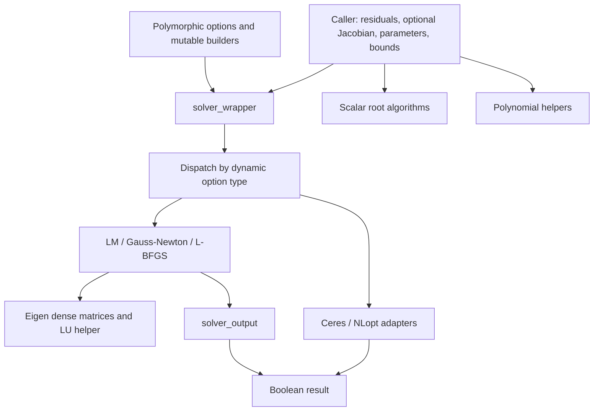
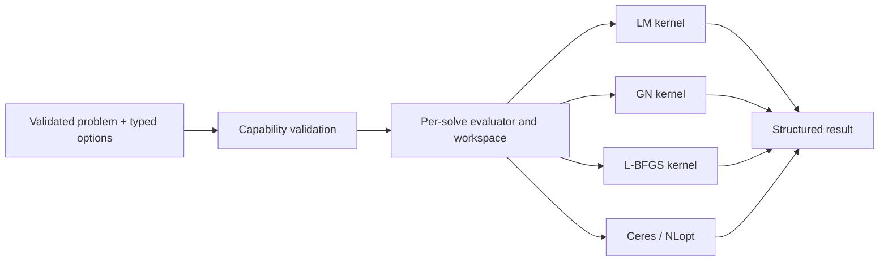

# Solver design review and redesign session — 2026-09-26

Status: review completed; redesign proposed, implementation pending.

## Scope and prior documentation

No existing first-party redesign session was found. The repository's README has an architecture tree and usage guidance, but the linked `docs/algorithms.md`, `docs/api.md`, `docs/benchmarks.md`, and `docs/configuration.md` were absent. Searches covered tracked and untracked first-party files, including hidden files, and available Git commit messages for redesign, design review, and architecture. Vendored dependency documentation and generated build trees were excluded from the session search. This conclusion applies to the local repository; external discussions were not searched.

This session reviews the working tree based on commit `5fae272`, including existing local edits. Additional dependency edits appeared during the review; they were preserved and the native build was reconfigured. Findings concern the first-party wrapper, options, outputs, native algorithms, Ceres/NLopt adapters, scalar roots, polynomial roots, build integration, tests, and documentation. Optional-backend runtime behavior was inspected in source but not executed. No production solver implementation was changed in this session.

## Assessment

The useful foundation is a small residual-based library with separate numerical kernels, optional external backends, a convenient vector wrapper, and a shared set of analytical test problems. Preserve these boundaries. The main redesign need is a precise mathematical and execution contract: the current common API hides differences in objectives, constraints, termination, and failures. Those differences already produce incorrect answers and misleading success reports.

An incremental redesign is preferable to replacing every algorithm at once. First fix demonstrated contract violations and numerical defects. Then introduce validated problem/options objects, structured results, shared evaluation services, and explicit backend capabilities. Sparse problems, automatic solver selection, GPU execution, and a general plugin registry should follow demonstrated requirements.

## Current architecture



The wrapper dispatches according to option type; it does not select an algorithm from problem characteristics. Every optimization callback returns residuals, including the L-BFGS and NLopt paths. There is no scalar-objective API, general constraint API, sparse Jacobian API, residual-block graph, or automatic differentiation engine. `aad_jacobian` selects a caller-supplied Jacobian; its name does not describe a built-in differentiation capability.

| Area | Current behavior | Consequence |
|---|---|---|
| Objective | LM/GN use residual norm for function stopping; L-BFGS uses squared norm; NLopt receives squared norm | The same tolerance has different meanings |
| Constraints | Wrapper accepts bounds for every solver | Acceptance of an option does not imply enforcement |
| Output | Native structured output is reduced to `bool`; Ceres returns usability; NLopt wrapper returns true after normal completion | Caller cannot distinguish convergence, unavailable backend, or numerical failure consistently |
| Linear algebra | Public Eigen aliases; dense Jacobians; normal equations solved by partial-pivot LU | Dense-only design with no explicit rank/factorization failure contract |
| Derivatives | Five implementations of central finite differences with different absolute bumps | Inconsistent behavior and repeated allocations |
| Configuration | Inheritance, mutable solver enum, mutable builders returning shared const pointers | Multiple sources of identity and misleading immutability |
| Roots | Scalar algorithms return `bool`; polynomial helpers return a single `double` | Failure information and root-selection semantics are fragmented |

## Findings, ordered by priority

P1 means a correctness or execution-contract defect to resolve before expanding the advertised API. P2 means a significant numerical, integration, or maintainability weakness. “Reproduced” refers to the companion probes; “source-confirmed” means the behavior follows directly from inspected control flow. Recommendations are proposals, not claims that the new behavior exists.

### F01 — P1: bounds can be silently discarded

Evidence: [wrapper](../../include/solver_wrapper.cpp), `solve_lm`, `solve_lbfgs`, and `solve_gn`; [Ceres](../../include/solvers/ceres_solver.cpp), bounds block; [NLopt](../../include/solvers/nlopt_solver.cpp), bounds block.

The wrapper validates bound-vector lengths, then forwards bounds only to Ceres and NLopt. Native solvers never receive them. Both external adapters apply bounds only when **both** bound vectors are nonempty, so a lower-only or upper-only constraint is discarded. Ordering, NaNs, and initial feasibility are not validated at the wrapper boundary.

Reproduced: minimizing `(x-2)^2` from zero with bounds `[0,1]` returns success and approximately `x=2` for LM, GN, and L-BFGS. One-sided external behavior is source-confirmed, not runtime-tested.

Decision: reject unsupported constraints before evaluating a callback. For supported backends, apply each bound side independently; validate dimensions, ordering, NaNs, and initial feasibility. Native bound support requires a deliberate constrained method and constrained stopping rules; simply clipping unconstrained steps is insufficient.

### F02 — P1: option construction is not reliably initialized or immutable

Evidence: [base options](../../include/solver_options/solver_options.h), short constructors and `max_num_iterations_`; the five solver option builders, for example [LM](../../include/solver_options/solver_options_lm.h).

`max_num_iterations_` has no member initializer. Builder-only constructors call the short base constructor without initializing it. Reading a default-built iteration budget therefore reads an indeterminate value. Explicitly supplying `with_max_iterations` avoids that particular defect. Negative signed budgets are also accepted and can become enormous unsigned budgets in native loops.

Each optimization builder returns its own `shared_ptr` as `shared_ptr<const ...>`, then remains able to mutate the same object. Reproduced: build with budget 7, mutate the builder to 99, and the previously built result now reports 99. Builders do not call `initialize`/`validate`; setters bypass the limited BFGS constructor validation. Zero history length, zero difference bump, invalid line-search factors, and nonfinite tolerances reach algorithms unchecked.

Decision: deterministic defaults, validation at the solve boundary, and value snapshots from builders. Preserve a pointer-returning compatibility builder only if it returns a fresh copy. Define budget zero explicitly; reject negative budgets. Avoid executing undefined behavior merely to demonstrate the uninitialized member; that finding is source-confirmed.

### F03 — P1: L-BFGS line-search failure is treated as an accepted trial

Evidence: [L-BFGS](../../include/solvers/lbfgs_solver.cpp), all `line_search::search` implementations and `solve`.

Line searches return `void`. Exhausting the search loop falls through to the outer solver, which consumes the last candidate and may update curvature history. The check `iter < max_iteration_linesearch()` inside a loop with the same condition cannot detect exhaustion. The Nocedal-Wright branch additionally sets its sufficient-decrease coefficient to `linesearch_tolerance()` without multiplying by the initial directional derivative. Its first evaluation at `step_max` can also call a domain-limited model at an unnecessarily extreme point.

Reproduced with `r(x)=10(x-1)`, `x=0`, backtracking, and one allowed search trial: the solver commits `x=100`, increasing squared residual cost from 100 to 980,100. It ultimately reports nonconvergence, but has already committed the rejected step.

Decision: return a structured line-search result with an accepted flag, step, candidate evaluation, and failure reason. Commit parameters and history only after acceptance. On exhaustion retain the last accepted iterate and report line-search failure. Verify sufficient-decrease and curvature inequalities independently for each advertised search mode.

### F04 — P1: stationary least-squares solutions are mishandled

Evidence: [LM](../../include/solvers/levenberg_marquardt_solver.cpp), initial evaluation and accepted-step convergence block; [L-BFGS](../../include/solvers/lbfgs_solver.cpp), initial evaluation and backtracking directional check; [GN](../../include/solvers/gauss_newton_solver.cpp), gradient calculation and convergence block.

LM checks the initial residual norm but checks gradient convergence only after accepting a strict improvement. At a stationary minimum with nonzero residual, there may be no improving step to accept. L-BFGS similarly enters a line search before checking the initial gradient. GN tests the gradient from the previous iterate after committing a new iterate.

Reproduced using `r(x)=[x-1,x+1]`, `J=[1,1]^T`, and `x=0`: the exact minimizer has zero gradient and residual norm `sqrt(2)`. LM returns `NOT_CONVERGED`; BFGS with backtracking throws on the zero search direction. These are legitimate least-squares problems, not failed root-finding problems.

Decision: evaluate initial stationarity before constructing a step. Check stopping quantities at the iterate actually returned. Separate “small residual” from “stationary least-squares minimum.” Include noisy/inconsistent data and nonzero minima in the main suite.

### F05 — P1: LM's gain ratio mixes incompatible quantities

Evidence: [LM](../../include/solvers/levenberg_marquardt_solver.cpp), `x2_p`, `numerator_rho`, `denominator_rho`, and Nielsen damping update.

The numerator is `||r|| - ||r_trial||`, while the denominator `step.dot(lambda * diagonals * step + J^T r)` is a quadratic-model reduction quantity. These are not the actual and predicted reductions of the same objective. Under uniform residual/Jacobian scaling, the numerator scales linearly and the denominator quadratically, changing the gain ratio for an otherwise equivalent problem. The Nielsen update also applies `fabs` to the cubic expression; its damping behavior warrants a derivation rather than relying on the method name.

Source-confirmed formula mismatch; this review does not claim a runtime convergence failure from that mismatch alone.

Decision: define `F(x)=0.5*r^T*r`, compute actual reduction from that cost, and compute predicted reduction from the actual proposed step and linearized residual model. Recompute it after geodesic or quadratic step modifications. Require finite positive predicted reduction. Document and test damping behavior for poor, adequate, and excellent model agreement; temporarily make advanced corrections opt-in while validating the baseline method.

### F06 — P1: scalar-root contracts allow wrong-target and false-bracket success

Evidence: [root algorithms](../../include/solvers/root_finding_algorithms.cpp), `dekker` and bracket sign checks; [root options](../../include/solver_options/root_finding_options.h).

Dekker never subtracts `function_offset`, despite sharing options with the other methods. Its implementation uses a derivative-based safeguarded Newton step, so the public algorithm name should also be reconciled with its actual method.

Reproduced: solving `f(x)=x` with offset 2 and bracket `[-1,3]` returns success at zero instead of 2. Separately, multiplication-based sign checks can underflow: bisection accepts constant positive `f(x)=1e-200` on `[0,1]` and reports success from bracket width with function tolerance `1e-250`, even though no root exists.

Decision: centralize target subtraction and finite-value checks, test endpoint zeros explicitly, and compare signs without multiplying values. Define absolute/relative location tolerances, safe midpoint calculation, stagnation handling, and distinct invalid-bracket/iteration-limit/evaluation-failure statuses. Apply the same root-contract tests to every compatible method, including offset cases.

### F07 — P1: polynomial results do not consistently represent roots

Evidence: [polynomial header](../../include/solvers/polynomial_solver.h), [implementation](../../include/solvers/polynomial_solver.cpp), and [existing polynomial tests](../../Testing/Cxx/TestRootFindingAndPolynomialSolvers.cpp).

The quadratic routine rejects a repeated real root because it requires a strictly positive discriminant. It can return a negative value even though the comment promises a minimum positive root. Its direct quadratic formula also needs cancellation-resistant evaluation for widely separated roots.

The quartic comment promises the minimum positive root, but the code takes a maximum. It initializes the candidate to `numeric_limits<double>::min()`—the smallest positive normal number—and returns `max(root, threshold)`. That operation can fabricate a value that is not a root. Degenerate resolvent cases also lack explicit handling around `sqrt(2*m)` and division by that value.

Reproduced: `(x-1)^2` returns NaN; `x^4-10x^2+9` returns 3 where the comment promises 1; threshold 10 returns 10 with polynomial residual 9009; `x^4+1` returns about `2.225e-308` with residual 1. Existing tests explicitly expect the repeated-root NaN and threshold clamp, so a passing suite does not resolve this API contradiction.

Decision: separate root computation from selection policy. Represent no real root/no eligible root explicitly. Treat a threshold as a filter on actual roots, not a clamp. If existing callers need a clamped application value, expose it as a separately named operation. Verify returned roots with a coefficient-scaled residual and cover repeated, degenerate, negative-only, and poorly scaled polynomials.

### F08 — P2: “success,” tolerances, and diagnostics differ across backends

Evidence: [wrapper](../../include/solver_wrapper.cpp), [output](../../include/solver_output.cpp), [NLopt](../../include/solvers/nlopt_solver.cpp), and [Ceres](../../include/solvers/ceres_solver.cpp).

Native status distinguishes only three convergence reasons and `NOT_CONVERGED`. The wrapper discards even that distinction. An unavailable external backend returns false; invalid inputs may throw; Ceres returns `IsSolutionUsable()`; NLopt returns true on any normal adapter completion. These are different contracts.

`solver_output::x2_` actually contains the residual norm, not its square. LM/GN compare that norm to function tolerance, whereas L-BFGS compares squared norm. NLopt forwards a relative objective tolerance. Ceres forwards its native tolerance semantics. Native gradient scaling also differs by a factor of two between LM/GN and BFGS. LM/GN parameter checks lack the absolute scale floor used by BFGS. Iteration counters can be off by one when a loop exits with `break` after completing a step.

Decision: return structured termination, usability, objective, residual norm, gradient norm, step norm, counters, and backend-specific status. Name tolerance quantities and units explicitly. Share the mathematical objective but retain backend stopping options where exact equivalence cannot be promised. Expose effective settings rather than relabeling dissimilar backend controls.

### F09 — P2: dense linear solves have no rank or failure policy

Evidence: [Eigen support](../../include/detail/eigen_support.h), `linear_system_solver`; LM/GN normal-equation construction.

Both native least-squares methods form `J^T J` and use `PartialPivLU`, which does not provide the required rank-revealing policy at this call boundary. No factorization status, linear residual, rank estimate, or finite-step check is exposed. Underdetermined and singular cases are accepted without a declared solution convention. Normal equations also worsen conditioning; a successful solve call is not evidence of an accurate step. LM's multiplicative diagonal damping leaves a zero diagonal zero in its LEVENBERG mode.

Decision: use rank-revealing QR for the robust dense GN path and an augmented damped least-squares solve for robust LM. Permit faster normal-equation paths only with explicit diagnostics and fallback. Define rank-deficient and underdetermined behavior, including whether a minimum-norm step is supported. Return failure information from the linear solver and test near dependence as well as exact singularity.

### F10 — P2: L-BFGS history does not implement a stable chronological memory window

Evidence: [L-BFGS](../../include/solvers/lbfgs_solver.cpp), curvature storage and two-loop recursion near the end of `solve`.

Pairs are inserted with a cyclic `iter_tau`, but only rows `0..iter_tau` are traversed. On wraparound most stored history becomes temporarily unused. The first loop traverses insertion order and the second reverses it, rather than consistently using newest-to-oldest then oldest-to-newest over the retained chronological window. Divisions by `s^T y` and `y^T y` have no curvature safeguards. Flipping the final direction's sign cannot repair undefined or nonfinite curvature arithmetic.

Decision: track history count independently from insertion index, iterate in explicit chronological order, skip/reset unsuitable curvature pairs, and fall back to steepest descent when needed. Compare computed directions against an independent small reference after more than `tau` updates. The observed happy-path convergence is insufficient to certify the recurrence.

### F11 — P2: callback validation and differentiation are fragmented

Evidence: native solvers and both external adapters; [support macros](../../include/detail/support.h).

Direct constructors do not consistently validate dimensions or callback presence. Output callback sizes and finiteness are generally trusted. A malformed callback can resize an Eigen vector/matrix, leave coefficients unwritten, or return NaN. A callback cannot explicitly report a recoverable domain failure. Ceres `Evaluate` returns true unconditionally after invoking callbacks.

Finite differences are duplicated with fixed absolute bumps: native configurable bumps, and hardcoded `1e-8` in the adapters. Central differences can cross a valid bound or model domain even when the iterate is feasible. Public options can request an analytic Jacobian while silently falling back to finite differences. No common evaluation budget counts their additional calls.

Decision: one evaluator service validates dimensions, finiteness, derivative policy, scaling, and counters. Use representable, parameter-scaled difference steps with bound-aware one-sided fallback. Distinguish analytic-required, finite-difference, and automatic-fallback policies. Provide explicit recoverable evaluation failure and define callback exception behavior. Keep diagnostics active in Release where correctness depends on them.

### F12 — P2: adapters expose controls they do not honor

Evidence: [NLopt](../../include/solvers/nlopt_solver.cpp), algorithm mapping and `solve`; [Ceres options mapping](../../include/solvers/ceres_solver.cpp).

NLopt never forwards an iteration/evaluation limit. Its constraint registration is commented out, and augmented-Lagrangian enum variants do not configure their named local optimizers. Its exposed gradient tolerance is unused. Ceres hardcodes `check_gradients=false` despite exposing a setter. Public `log_file` settings are not consumed by solver implementations. Static casts from copied Ceres enums couple correctness to numeric enum agreement.

The Ceres adapter presents the whole problem as one parameter block and one residual block with a dense Jacobian. Exposing sparse/Schur/GPU-related option names does not create structured sparsity or prove an accelerated execution path.

Decision: build a tested option-to-backend mapping and report unsupported settings. Distinguish iteration limits from function-evaluation limits; NLopt's supported budget must be named accurately. Reject unsupported algorithm configurations, use explicit enum mapping, preserve native result codes, and verify capabilities against the compiled dependency. Do not advertise general constraints through this residual-only API.

### F13 — P2: ownership and backend abstraction need narrower promises

Evidence: [Eigen support](../../include/detail/eigen_support.h), [wrapper](../../include/solver_wrapper.h), [NLopt](../../include/solvers/nlopt_solver.cpp), and [Ceres](../../include/solvers/ceres_solver.cpp).

Eigen aliases centralize includes but do not hide Eigen's API or ABI: public callbacks and solver bodies use Eigen methods and expression operations directly. Replacing the numerical backend would require more than editing one header. Copying vectors at wrapper and adapter boundaries and allocating dense workspaces on every solve are real costs, but no measurements here establish them as the dominant bottleneck.

NLopt's stored finite-difference lambda captures `this`; Ceres stores a similar lambda after its first derivative-free solve. Implicitly copying such an adapter copies a closure still referring to the original instance. This creates surprising coupling and potential dangling access if that original object is destroyed. A const wrapper also does not make captured user state thread-safe.

Decision: explicitly retain Eigen as the dense public type dependency for the first redesign. Keep workspaces local to a solve, document callback lifetimes/reentrancy, and avoid stored self-capturing callbacks or define safe copy/move behavior. Introduce reusable workspace or sparse operator interfaces only when workloads justify them.

### F14 — P2: packaging and tests do not support the README's full claims

Evidence: [CMake](../../CMakeLists.txt), [dependencies](../../Cmake/SolversDependencies.cmake), [tests](../../Testing/Cxx/TestSolverBackends.cpp), [CI](../../.github/workflows/ci.yml), and [README](../../README.md).

The top-level build creates a build-tree alias but no Solvers install/export/package configuration supporting the documented `find_package(Solvers REQUIRED)` flow. Public headers use a mixture of `include/...` and shorter paths that must be reconciled with an installation layout. Eigen and Logging are actual required dependencies. The fresh configuration selected an installed fmt through Logging, so bundled top-level dependencies alone do not guarantee a fully pinned transitive build.

Tests share four useful optimization problems, but all have zero-residual solutions. Optional-backend cases skip when disabled. Several polynomial tests encode current behavior instead of the stated mathematical contract. CI has backend/shared/sanitizer configurations, which is valuable, but that matrix is Linux-only and was not executed in full during this review. Benchmark speedups, automatic selection, general scalar L-BFGS optimization, and unconditional convergence claims in the README are not established by this review.

Decision: add mathematical and API contract tests before broadening algorithm claims. Test an installed external consumer and an `add_subdirectory` consumer, make dependency selection explicit, and publish reproducible benchmarks with problem sizes, compiler/build options, hardware, accuracy, and evaluation counts. Replace missing documentation links as their documents are created; do not equate this review with having completed the reference manual.

## Proposed redesign

### 1. Separate problem definitions from algorithms

Retain three mathematical entry points: `least_squares_problem`, `scalar_root_problem`, and polynomial root computation. Introduce a separate scalar-objective problem only if required; a residual callback cannot faithfully stand in for arbitrary signed objectives. For least squares, define `F(x)=0.5*||r(x)||^2`, `J(i,j)=dr_i/dx_j`, and `g=J^T r`. Explicitly supplied weights must transform residuals and Jacobians consistently.

A least-squares problem owns dimensions and callback handles, with optional bounds, parameter scales, and derivative policy. Dimensions are checked at construction and outputs are checked at evaluation. User-captured data must remain alive for the synchronous solve. Evaluation failures must distinguish an invalid trial point from invalid input or a programming exception.

### 2. Use typed options and explicit capabilities

Provide typed overloads for native algorithms and a C++17 `std::variant` of supported solver options at the runtime-dispatch layer. For this closed set of five backends, a registration/plugin framework adds complexity without a demonstrated need. Remove mutable solver identity from configuration; the active option type already identifies it.

Every options value has initialized defaults and a `validate` operation. Generic budgets describe iterations, evaluations, and time separately. Backend options retain accurately named native stopping controls. A capability query describes least squares, bounds, derivative requirements, sparse structure, and availability; validation uses both the chosen algorithm and the particular problem/options combination.

| Backend | Initial redesign scope | Unsupported requests |
|---|---|---|
| Native LM/GN/L-BFGS | Dense unconstrained residual problems | Reject bounds until a deliberate bound-capable method exists |
| Ceres | Dense residual adapter; supported bound configurations | Reject options incompatible with the adapter/compiled features |
| NLopt | Residual-to-scalar adapter with tested algorithms and bounds | Reject unimplemented general constraints/local-optimizer configurations |

### 3. Return a structured result

Use one termination vocabulary across adapters while preserving native status and details. Suggested reasons: residual tolerance, gradient tolerance, step tolerance, relative cost tolerance, iteration limit, evaluation limit, time limit, invalid input, unsupported capability, evaluation failure, linear-solve failure, line-search failure, and numerical failure.

Keep `converged` separate from `has_usable_iterate`. A limit can leave a useful iterate without proving convergence. A small step can also mean stagnation, so return the measured residual/gradient/step quantities rather than concealing them in a bool.

Return final parameters and, for least squares, cost and residual norm. Include available gradient norm, iteration count, residual/Jacobian evaluation counts, accepted/rejected step counts, effective derivative mode, and optional backend details. Use optional diagnostics for quantities an adapter does not supply; zero must not mean “unknown.”

The new API accepts an initial point and returns a result rather than mutating caller storage during failed trials. The legacy wrapper can copy back the last accepted iterate and derive its bool from a documented mapping. Bounds violations and fabricated polynomial roots must not be preserved as compatibility features.

### 4. Share evaluation and reporting services, retain separate solver loops



The common evaluator handles callback contracts, derivative estimation, scales, counters, and finite values. Native numerical kernels retain their own trust-region or line-search state. Share accepted-iterate/result handling and linear-solve diagnostics without forcing external backends into a fabricated identical iteration loop. An optional iteration observer supports logging without putting file policy into each algorithm.

### 5. State numerical invariants explicitly

1. Returned diagnostics describe the returned iterate.
2. A rejected or invalid trial never replaces the last accepted iterate.
3. Accepted constraints are enforced, or the request is rejected before solving.
4. Objective, gradient, and model-reduction calculations use one declared scaling convention.
5. All success paths have finite, validated output and a named termination condition.
6. Every callback invocation counts against the applicable evaluation budget, including finite differences and retries.
7. Root-selection results are actual roots satisfying the selection policy; absence is explicit.

For native least squares, define independent residual absolute tolerance, gradient tolerance in scaled coordinates, parameter absolute/relative tolerances, and cost-change tolerance. A small-step criterion should include an absolute floor, such as `||delta_x|| <= x_abs + x_rel*||x||`, evaluated in documented coordinates. Avoid requiring residuals to approach zero on noisy data. Tolerance equivalence across external backends must be documented as an adapter mapping, not assumed.

## Session decisions and alternatives

| Decision | Rationale | Alternative considered |
|---|---|---|
| Incremental correction followed by API migration | Existing kernels and callers can be retained while defects are isolated | A full rewrite would obscure correctness regressions |
| Keep Eigen as an explicit dense dependency | Matches actual public types and implementation | Backend-neutral matrix interfaces add work without a current second backend |
| Keep runtime dispatch small and typed | Five known backends need exhaustive handling, not registration machinery | Open plugin registry only when external backend loading is required |
| Introduce structured results before adding features | Enables trustworthy failure handling and cross-backend comparisons | Continuing bool-only results loses essential information |
| Reject unsupported bounds immediately | A feasible problem must not silently become unconstrained | Projection alone changes algorithm behavior without establishing convergence |
| Keep general scalar objectives separate | Residual least squares has a distinct mathematical contract | Reusing the residual API misrepresents supported objectives |
| Make polynomial selection explicit | Resolves minimum/maximum/clamp contradictions | Changing comments alone would leave non-root outputs |

These are recommendations from this repository review, not an assertion that maintainers have approved an API break. No external reviewers or design meeting participants are implied.

## Migration plan and acceptance criteria

| Stage | Concrete work | Required evidence before completion |
|---|---|---|
| 1: immediate correctness | Initialize/validate options; snapshot builders; reject unsupported bounds; honor one-sided adapter bounds; fix Dekker offset/sign checks; stop committing failed line-search trials; correct initial stationarity | Regression cases for F01–F04/F06 pass in Release; invalid requests do not evaluate callbacks |
| 2: numerical kernels | Derive/test LM reduction; fix L-BFGS history and curvature handling; add rank-aware linear solves; correct polynomial contracts with migration notes | Nonzero minima, residual scaling, rank deficiency, history wraparound, ill-scaled and repeated-root cases pass against independent expectations |
| 3: result and evaluation layer | Structured results, counters, derivative policy, finite-value handling, accepted-iterate invariant | All native methods obey result consistency and failure-state tests; callback budgets include numerical derivatives |
| 4: adapter parity | Map Ceres/NLopt status/settings/capabilities; enforce limits; define exception and copy/move behavior | Optional-backend builds test one-sided bounds, unavailable features, native failure/limit statuses, and analytic versus numerical derivatives |
| 5: public API and delivery | Typed problems/options with compatibility wrapper; coherent installed includes; CMake package/export; accurate README/reference docs | Both consumer modes compile and run; documented examples compile; migration tests cover old entry points |
| 6: measured performance | Reuse workspaces where justified, quantify allocation/callback costs, consider sparse/block extension | Benchmarks report accuracy and evaluation counts alongside timing and reproducible environment metadata |

Stages 1 and 2 should produce small, independently reviewable changes. Do not combine a numerical algorithm replacement with a broad file-layout rename. A later release can move public headers under `include/solvers/` and implementation files under `src/` after packaging and compatibility tests exist.

Unresolved product choices are whether arbitrary scalar objectives are actually needed, whether native bound support is worth maintaining alongside adapters, which polynomial selection behavior callers depend on, and whether large sparse/block problems are in scope. The recommended starting scope is dense least squares plus separately documented scalar/polynomial roots; none of these open choices prevents correcting demonstrated defects.

## Validation performed

A fresh Release build used Clang 22.1.2 on macOS with Ceres/NLopt disabled, followed by CTest. Result: **51 passed, 8 skipped, 0 failed** (59 discovered). The skipped cases are the four problems for each optional backend. No claim is made about optional-backend runtime validation, sanitizers, the complete CI matrix, global convergence, or measured performance.

The standalone [review probes](solver-design-probes.cpp) were compiled against that native build. The external CMake consumer recipe below was also configured, built, and run successfully, reproducing the same observations. All 34 local links in this review were checked. The probes print observations rather than passing assertions against known-bad behavior. They are review artifacts, not new acceptance tests. Promote their intended contracts into the main test suite when fixing the corresponding findings.

| Probe | Observed result |
|---|---|
| Bounds `[0,1]`, residual `x-2` | LM/GN/L-BFGS all return success near `x=2` |
| Build options at 7 iterations, mutate builder to 99 | Previously built options report 99 |
| Dekker `f(x)=x`, target 2 | Success at 0 |
| Bisection constant positive `1e-200` | Success near `9.09e-13` despite no root |
| Stationary nonzero least-squares minimum | LM status 3 (`NOT_CONVERGED`); backtracking BFGS throws |
| One-trial BFGS backtracking search | Commits `x=100`; squared cost rises from 100 to 980,100 |
| Repeated quadratic root | NaN instead of 1 |
| Quartic positive-root selection | 3 instead of documented minimum 1 |
| Quartic threshold 10 | Returns 10 with residual 9009 |
| Quartic with no real roots | Returns smallest positive normal double with residual 1 |

Native suite reproduction from the repository root:

```sh
cmake -S . -B /tmp/solvers-design-review-20260926 -G Ninja \
  -DCMAKE_BUILD_TYPE=Release -DSOLVERS_ENABLE_TESTING=ON \
  -DSOLVERS_ENABLE_CERES=OFF -DSOLVERS_ENABLE_NLOPT=OFF \
  -DSOLVERS_ENABLE_CLANGTIDY=OFF
cmake --build /tmp/solvers-design-review-20260926 --parallel 4
ctest --test-dir /tmp/solvers-design-review-20260926 --output-on-failure
```

To build the probes with dependency usage requirements preserved, create a temporary external CMake project with the following `CMakeLists.txt` and configure it with `-DSOLVERS_SOURCE_DIR=/absolute/path/to/Solvers`. This is also an `add_subdirectory` consumer check; it does not use the currently missing installed package.

```cmake
cmake_minimum_required(VERSION 3.22)
project(SolverDesignProbes LANGUAGES C CXX)
set(SOLVERS_ENABLE_TESTING OFF CACHE BOOL "" FORCE)
set(SOLVERS_ENABLE_CERES OFF CACHE BOOL "" FORCE)
set(SOLVERS_ENABLE_NLOPT OFF CACHE BOOL "" FORCE)
set(SOLVERS_ENABLE_CLANGTIDY OFF CACHE BOOL "" FORCE)
add_subdirectory("${SOLVERS_SOURCE_DIR}" solvers)
add_executable(solver_design_probes
  "${SOLVERS_SOURCE_DIR}/docs/reviews/solver-design-probes.cpp")
target_link_libraries(solver_design_probes PRIVATE Solvers::Solvers)
```
