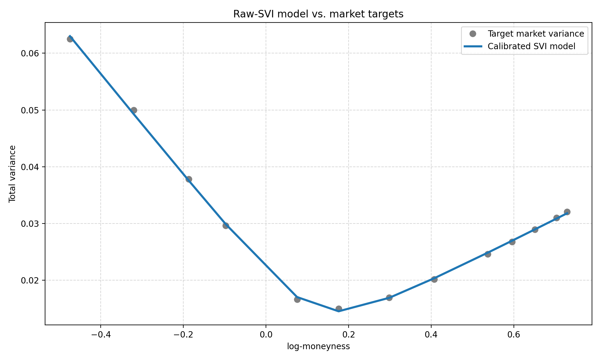
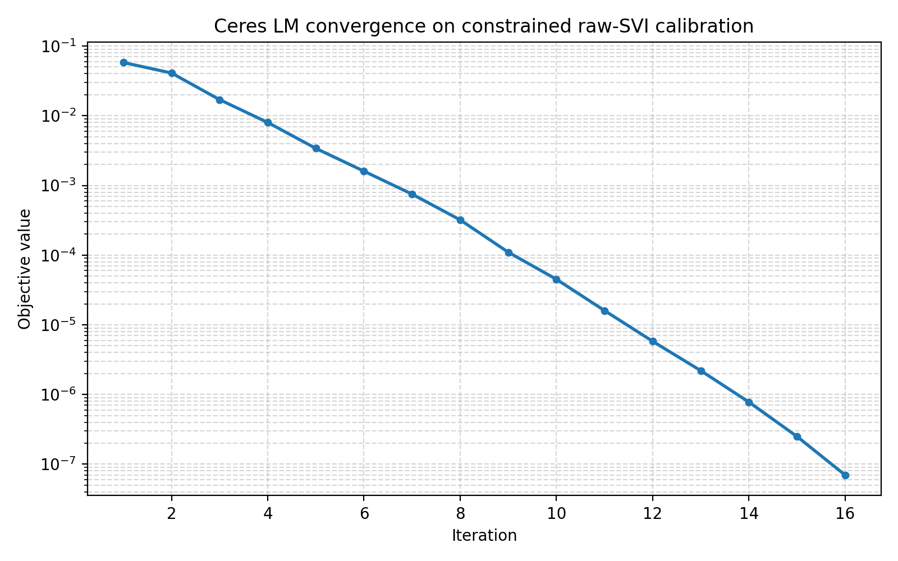

# SVI calibration example

This example calibrates a raw-SVI smile under box constraints using the same formulation described in Ferhati (2020):

- Robust Calibration For SVI Model Arbitrage Free
- ResearchGate link: https://www.researchgate.net/publication/340530301_Robust_Calibration_For_SVI_Model_Arbitrage_Free

The benchmark uses the EURO STOXX 50 raw-SVI fixture and fits the 5-parameter model with bound-aware least squares. The raw parameterization keeps the admissible region explicit:

- a > 0
- b > 0
- |rho| < 1
- m free within the quoted log-moneyness range
- sigma > 0

## Calibration setup

The implementation is in [Testing/Cxx/BenchmarkSviCalibration.cpp](Testing/Cxx/BenchmarkSviCalibration.cpp). It uses the paper’s raw-SVI parameters and imposes the admissible-box constraints directly on the optimization variables rather than solving an unconstrained reparameterized form.

The benchmark is built with:

```bash
cmake -S . -B build -DSOLVERS_ENABLE_TESTING=ON -DSOLVERS_ENABLE_BENCHMARKS=ON
cmake --build build --target SviCalibrationBenchmark
./build/Testing/Cxx/SviCalibrationBenchmark --benchmark_min_time=0.01s
```

## Problem data

The benchmark uses the 13-quote EURO STOXX 50 raw-SVI dataset from the paper, recovered from parity-implied forward:

- Quotes: 13
- Maturity: 1.01Y
- Forward: 3325.0193
- Published curve RMSE: 4.40995 variance bp
- Published rounded parameters evaluated on the recovered log-moneyness: 258.87366 variance bp RMSE

## Constrained model form

The model is the standard raw-SVI total variance model:

$$
\omega(k) = a + b \left( \rho (k - m) + \sqrt{(k - m)^2 + \sigma^2} \right)
$$

with the box constraints applied to the raw parameters:

- $a \in [1e-5, \max(w)]$
- $b \in [0.001, 1.0]$
- $\rho \in [-1.0, 1.0]$
- $m \in [2 \cdot \min(k), 2 \cdot \max(k)]$
- $\sigma \in [0.01, 1.0]$

This reflects the paper’s admissible calibration domain and avoids silently hiding constraints behind logistic reparameterizations.

## Verified benchmark output

In the current local build, the constrained calibration converges successfully with Ceres LM:

- Status: converged
- Iterations: 16
- Median time: 42.78 us
- RMSE: 3.37518 variance bp
- Max error: 7.00952 variance bp
- Minimum density factor: 0.25434

### Calibrated parameters

- a = 0.0085635
- b = 0.0637952
- rho = -0.4133805
- m = 0.1229743
- sigma = 0.1026497

This result is consistent with the paper’s reported left-skew, where the rounded published tuple has rho=+0.43 but the recovered left-skew calibration gives rho<0.

## Model vs. targets



The plot below compares the calibrated raw-SVI curve against the target market variance points in log-moneyness space.

## Convergence trace



This convergence plot shows the objective dropping monotonically over the first ~16 iterations to reach the constrained minimum.

## Summary

This example is a good benchmark for solver quality under realistic constraint handling:

- It matches the paper’s calibration formulation.
- It exercises box-bounded least-squares behavior in the solver API.
- It exposes solver convergence quality, RMSE, and admissibility without relying on a hidden unconstrained transform.

This benchmark is intended to validate the constrained SVI calibration path rather than a relaxed unconstrained proxy.
